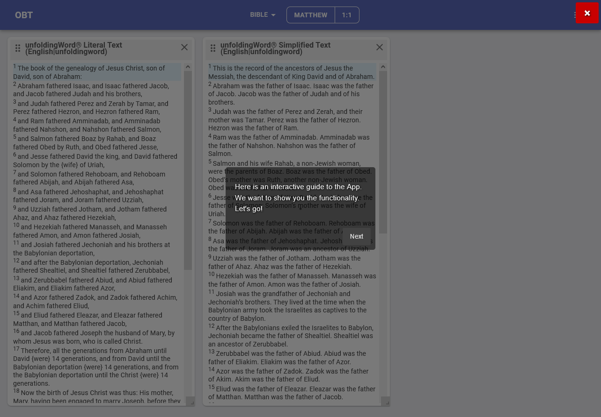
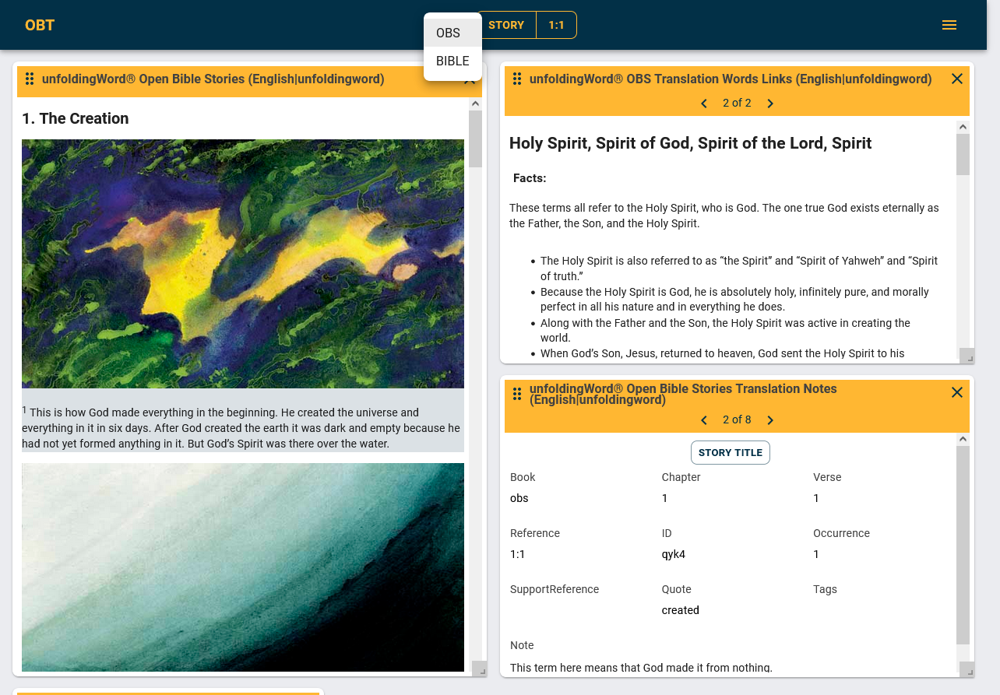
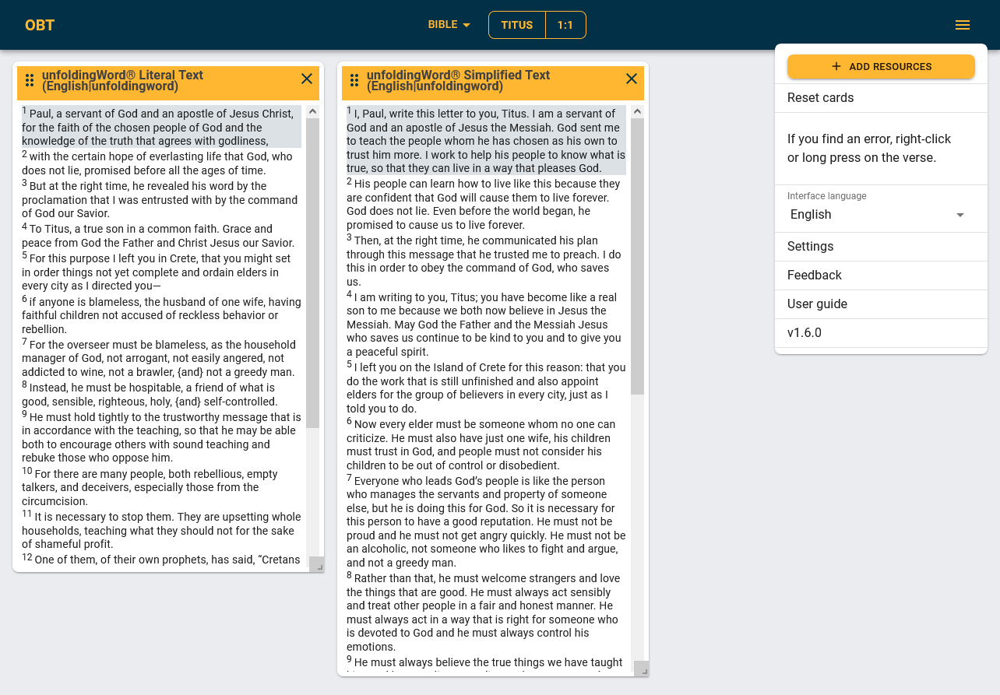
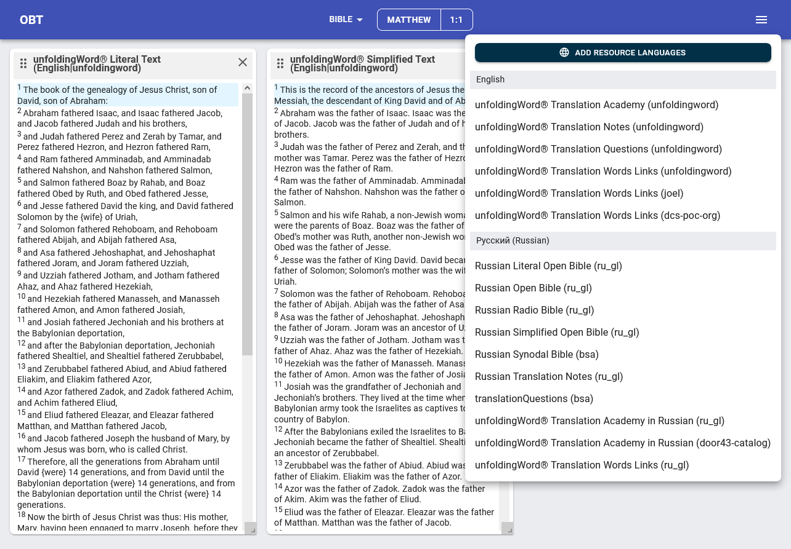
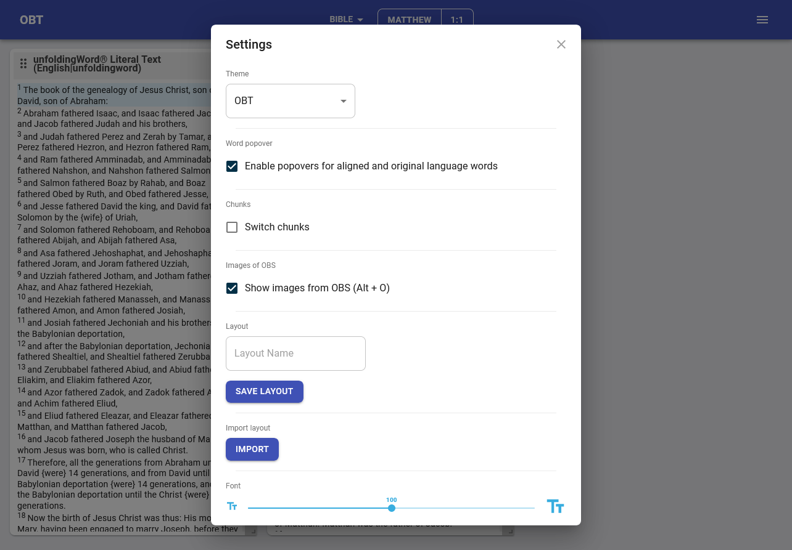
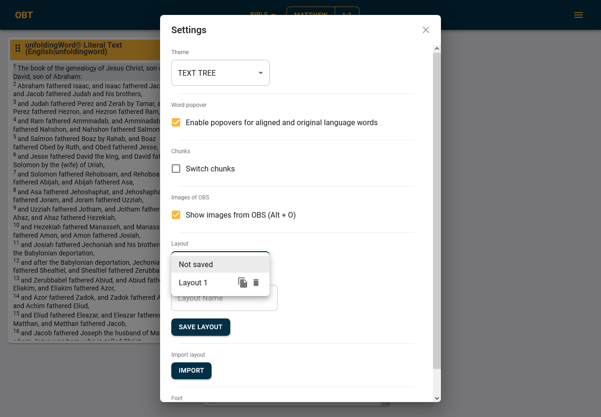
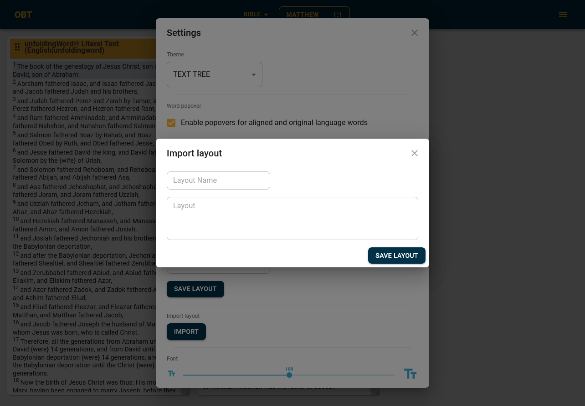
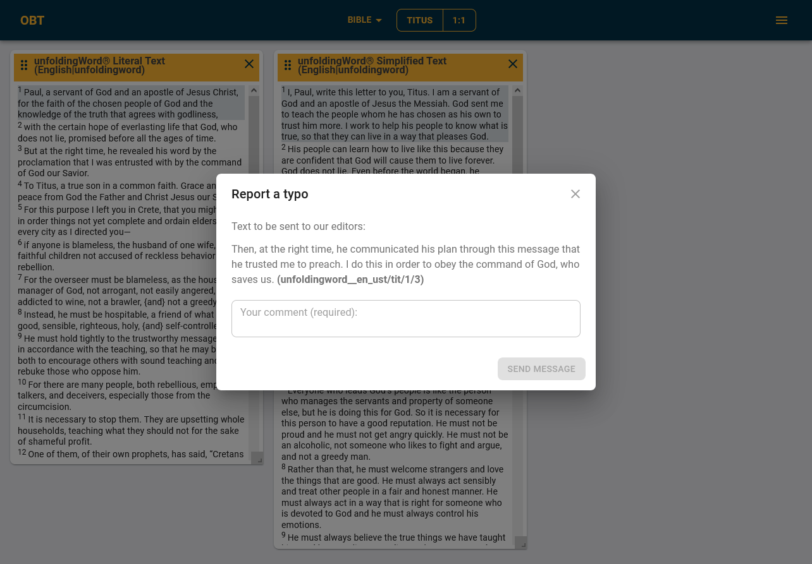

<div id="top"></div>
<!--
*** Thanks for checking out the Best-README-Template. If you have a suggestion
*** that would make this better, please fork the repo and create a pull request
*** or simply open an issue with the tag "enhancement".
*** Don't forget to give the project a star!
*** Thanks again! Now go create something AMAZING! :D
-->

<!-- PROJECT SHIELDS -->
<!--
*** I'm using markdown "reference style" links for readability.
*** Reference links are enclosed in brackets [ ] instead of parentheses ( ).
*** See the bottom of this document for the declaration of the reference variables
*** for contributors-url, forks-url, etc. This is an optional, concise syntax you may use.
*** https://www.markdownguide.org/basic-syntax/#reference-style-links
-->
[![Contributors][contributors-shield]][contributors-url]
[![Forks][forks-shield]][forks-url]
[![Stargazers][stars-shield]][stars-url]
[![Issues][issues-shield]][issues-url]
[![MIT License][license-shield]][license-url]

<!-- PROJECT LOGO -->
<br />
<div align="center">
  <a href="https://github.com/texttree/bsa">
    
  </a>

  <h3 align="center">OPEN BIBLE TEXT</h3>

  <p align="center">
    An application for advanced Bible study using opensource materials from git.door43.org.
    <br />
    <br />
    <a href="https://openbibletext.com/">View Production</a>
    ·
    <a href="https://develop--tt-bsa.netlify.app/">View Develop</a>
    ·
    <a href="https://github.com/texttree/bsa/issues">Report Bug</a>
    ·
    <a href="https://github.com/texttree/bsa/issues">Request Feature</a>
  </p>
</div>

<p align="center">
  <a href="https://crowdin.com/project/obt">Help us translate - Crowdin</a>
</p>

***
<!-- TABLE OF CONTENTS -->
<details>
  <summary>Table of Contents</summary>
  <ol>
    <li>
      <a href="#about-the-project">About The Project</a>
      <ul>
        <li><a href="#built-with">Built With</a></li>
      </ul>
    </li>
    <li>
      <a href="#getting-started">Getting Started</a>
      <ul>
        <li><a href="#prerequisites">Prerequisites</a></li>
        <li><a href="#installation">Installation</a></li>
      </ul>
    </li>
    <li><a href="#usage">Usage</a></li>
    <li><a href="#roadmap">Roadmap</a></li>
    <li><a href="#contributing">Contributing</a></li>
    <li><a href="#license">License</a></li>
    <li><a href="#contact">Contact</a></li>
    <li><a href="#acknowledgments">Acknowledgments</a></li>
  </ol>
</details>

***
<!-- ABOUT THE PROJECT -->
## About The Project

**Purpose**
- Enable churches to read and study Scripture and OBS in their own language using all the opensource materials from git.door43.org

- Give translators the opportunity study the Scriptures using all the opensource materials from git.door43.org

**Problem**
- There are many resources that are already translated, but there was no tool for easy reading and learning
- Small nations do not always have the resources to publish their work

**Scope**
- Local second (Windows, Mac, Linux)
  - Downloadable
  - Also usable online
  - Sideloading
- Full book package support for browsing, viewing, listening
- Proskomma (search, versification, etc.)
- Text Annotator (shareable user generated notes) via Datatable editable
- Scripture commenting/reporting system
- Progressive Web App
- Downloadable for language-resource combinations via Catalog Next React Toolkit

**Background**
- We wanted to make a website that would help share the work done and help spread the Gospel

<p align="right">(<a href="#top">back to top</a>)</p>

***
### Built With

* [React.js](https://reactjs.org/)
* [Material-UI](https://v4.mui.com/)

<p align="right">(<a href="#top">back to top</a>)</p>

<!-- GETTING STARTED -->
***
## Getting Started

This is an example of how you may give instructions on setting up your project locally.
To get a local copy up and running follow these simple example steps.

<br/>

### Prerequisites

All data in OPEN BIBLE TEXT is taken from [Door43 Catalog](https://git.door43.org/catalog)

<br/>

#### Data

- The source must be cloned from its repository
- `yarn install` is used to resolve/install dependencies
- `yarn start` is used to start the local server listening on `localhost:3000`

<br/>

#### Local

- [Yarn](https://yarnpkg.com/) 1.x: please refer to their [installation guide](https://classic.yarnpkg.com/en/docs/install).

<br/>

### Installation/First Steps

1. Clone the repo
   ```bash
   git clone https://github.com/texttree/bsa.git
   ```
2. Install NPM packages
   ```bash
   yarn install
   ```
3. Copy `.env.example` and rename it

4. Run the project with the command
   ```bash
   yarn start
   ```
### Additional setting

#### Configuring Error Sending

1. Configuring backend for error reporting:
https://github.com/texttree/tsv-send-backend

2. Enter your URL in `.env` file in `REACT_APP_SERVER_LINK` variable

#### Configuring Feedback Sending

In our environment, we use lambda functions netlify and telegram bot.

You need to specify the bot token and chat ID in the `.env` file in `API_TELEGRAM_TOKEN` and `GROUP_TELEGRAM` variables

#### Set up new language support

You can configure resource language support in the `config` folder

__In progress...__

<p align="right">(<a href="#top">back to top</a>)</p>

***
<!-- USAGE EXAMPLES -->
## Usage/Integration

#### User`s guide

<p align="center">	</p>

#### Select BIBLE/OBS mode

<p align="center">	</p>

#### Main menu

<p align="center">	</p>

#### Add resources

<p align="center">	</p>

#### Settings

<p align="center">	</p>

#### Layout list

<p align="center">	</p>

#### Import layout

<p align="center">	</p>

#### Report a typo

<p align="center">	</p>

<p align="right">(<a href="#top">back to top</a>)</p>

***
<!-- ROADMAP -->
## Roadmap

See the [open issues](https://github.com/texttree/bsa/issues) for a full list of proposed features (and known issues).

This project uses Zenhub to manage the roadmap.

<p align="right">(<a href="#top">back to top</a>)</p>

***
<!-- CONTRIBUTING -->
## Contributing

Contributions are what make the open source community such an amazing place to learn, inspire, and create. Any contributions you make are **greatly appreciated**.  [Guidelines for external contributions.](https://forum.door43.org)

You can also simply open an issue with the tag "enhancement".
Don't forget to give the project a star! Thanks again!

If you would like to fork the repo and create a pull request.

1. Fork the Project
2. Create your Feature Branch (`git checkout -b feature/AmazingFeature`)
3. Commit your Changes (`git commit -m 'Add some AmazingFeature'`)
4. Push to the Branch (`git push origin feature/AmazingFeature`)
5. Open a Pull Request

<p align="right">(<a href="#top">back to top</a>)</p>

***
<!-- LICENSE -->
## License

Distributed under the MIT License. See `LICENSE` for more information.

<p align="right">(<a href="#top">back to top</a>)</p>

***
<!-- CONTACT -->
## Contact

Texttree - [Discord](https://discord.com/channels/867746700390563850/894978969613520956)

Help us translate - [Crowdin](https://crowdin.com/project/obt)

Project Link: [https://github.com/texttree/bsa](https://github.com/texttree/bsa)

<p align="right">(<a href="#top">back to top</a>)</p>

***
## Acknowledgments

* [unfoldingWord](https://github.com/unfoldingWord)
* [Zach P](https://github.com/ancientTexts-net)
* [Klappy](https://github.com/klappy)
* [Abel Pérez](https://github.com/abelpz)
* [Mark Howe](https://github.com/mvahowe)

<p align="right">(<a href="#top">back to top</a>)</p>

<!-- MARKDOWN LINKS & IMAGES -->
<!-- https://www.markdownguide.org/basic-syntax/#reference-style-links -->
[contributors-shield]: https://img.shields.io/github/contributors/texttree/bsa.svg?style=for-the-badge
[contributors-url]: https://github.com/texttree/bsa/graphs/contributors
[forks-shield]: https://img.shields.io/github/forks/texttree/bsa.svg?style=for-the-badge
[forks-url]: https://github.com/texttree/bsa/network/members
[stars-shield]: https://img.shields.io/github/stars/texttree/bsa.svg?style=for-the-badge
[stars-url]: https://github.com/texttree/bsa/stargazers
[issues-shield]: https://img.shields.io/github/issues/texttree/bsa.svg?style=for-the-badge
[issues-url]: https://github.com/texttree/bsa/issues
[license-shield]: https://img.shields.io/github/license/texttree/bsa.svg?style=for-the-badge
[license-url]: https://github.com/texttree/bsa/blob/master/LICENSE
